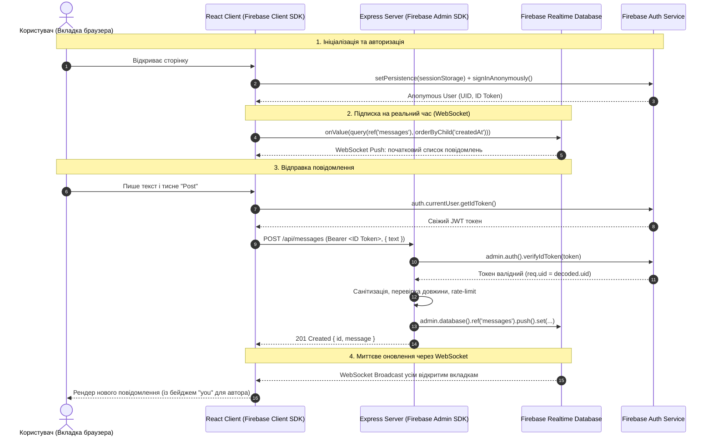

# 🔥 Повний гайд по Firebase в Anonymous Chat Demo

Цей документ описує всі модулі Firebase, які використовуються в проекті, як вони працюють під капотом, та в яких саме файлах вони задіяні.

---

## 🗺️ Загальна архітектура та потік даних

У проекті використовується **гібридна модель** взаємодії:
- **Читання (Read Stream):** Клієнт ↔ Firebase Realtime Database безпосередньо через **WebSocket**.
- **Запис (Write Stream):** Клієнт ➔ Express Backend (валідація + rate-limit) ➔ Firebase Admin SDK ➔ Realtime Database.

---

## 🧩 1. Модулі Firebase, що використовуються

### 1.1. Firebase Authentication (Клієнтський SDK)
* **Анонімний вхід (`signInAnonymously`):** Створює повноцінного користувача в системі Firebase без введення пошти чи пароля. Користувачеві призначається унікальний `uid` (ідентифікатор) та генерується короткоживучий JWT ID-токен (1 година).
* **Сесійна стійкість (`browserSessionPersistence`):** За замовчуванням Firebase Auth зберігає токени в `localStorage` (спільному для всіх вкладок одного домену). Ми перемикаємо збереження в `sessionStorage`. Завдяки цьому:
  * Кожна нова вкладка або нове вікно отримує **свій власний анонімний UID** (окремий співрозмовник).
  * При перезавантаженні сторінки (**F5**) стан береться з `sessionStorage` тієї ж вкладки — UID **не втрачається**, і бейдж **"you"** зберігається.
* **Отримання токену (`getIdToken`):** Клієнт бере криптографічно підписаний Google токен для передачі на наш бекенд.

### 1.2. Firebase Realtime Database (RTDB)
* **NoSQL JSON дерево:** На відміну від Firestore (колекції/документи), RTDB зберігає всі дані як одне велике JSON-дерево за адресою `/messages/{pushId}`.
* **Вбудовані WebSockets:** Клієнтська бібліотека (`@firebase/database`) автоматично встановлює стійке двостороннє WebSocket-з'єднання з серверами Google. Як тільки в базі з'являється новий запис — Google самостійно пушить дельту оновлення через відкритий сокет.
* **Сортування (`orderByChild`):** Запити сортуються за полем `createdAt` для хронологічного відображення.

### 1.3. Firebase Admin SDK (Серверний Node.js SDK)
* **Повні привілеї (Bypass Rules):** Працює на сервері від імені Service Account (службового акаунта). Має повний доступ до бази в обхід правил безпеки клієнта.
* **Верифікація токенів (`verifyIdToken`):** Перевіряє підпис JWT-токена, виданого клієнту, за допомогою публічних сертифікатів Google. Гарантує, що клієнт дійсно авторизований і не підробив свій `uid`.
* **Атомарний запис (`push().set()`):** Генерує лексикографічно впорядковані унікальні ID на основі часу (`-O...`) та зберігає повідомлення.

### 1.4. Security Rules (Правила безпеки)
* Декларативний конфіг у файлі `database.rules.json`.
* Дозволяє пряме читання тільки авторизованим користувачам (`auth != null`).
* **Повністю забороняє прямий запис з браузера** (`.write: false`), захищаючи базу від спаму або несанкціонованого видалення в обхід нашого Express API.

---

## 📂 2. Детальний огляд файлів проекту

### 🖥️ Клієнтська частина (Frontend)

#### 1. `client/src/firebase.ts` — Ініціалізація SDK
* Зчитує конфігурацію з кореневого `.env` через Vite (`import.meta.env.VITE_FIREBASE_*`).
* Ініціалізує `initializeApp` та експортує `auth` і `db`.

#### 2. `client/src/hooks/useAuth.ts` — Керування сесією та анонімним входом
* Слухає стан авторизації через `onAuthStateChanged`.
* Якщо сесії немає — встановлює `browserSessionPersistence` та викликає `signInAnonymously(auth)`.
* Якщо сесія вже є (наприклад, після F5) — зберігає поточного юзера без створення нового анонімного акаунта.

#### 3. `client/src/hooks/useMessages.ts` — Realtime підписка через WebSocket
* Створює запит `query(ref(db, 'messages'), orderByChild('createdAt'))`.
* Викликає `onValue(...)`, який відкриває WebSocket і автоматично викликає колбек при будь-яких змінах.
* Сортує отриманий список так, щоб найновіші повідомлення були зверху.

#### 4. `client/src/components/MessageInput.tsx` — Отримання токену для запиту
* Перед відправкою викликає `await auth.currentUser.getIdToken()`.
* Передає токен у заголовку `Authorization: Bearer <token>` до Express ендпоінту `POST /api/messages`.

---

### ⚙️ Серверна частина (Backend)

#### 5. `server/src/firebase-admin.ts` — Ініціалізація Admin SDK
* Автоматично завантажує `.env` через `dotenv`.
* Знаходить файл `service-account.json` у корені проекту та ініціалізує адмінський додаток через `cert(serviceAccount)`.
* Експортує адмінські екземпляри `auth` та `db`.

#### 6. `server/src/middleware/auth.ts` — Верифікація токенів
* Перехоплює заголовок `Authorization: Bearer <token>`.
* Викликає `await auth.verifyIdToken(token)`.
* Записує перевірений `uid` у `req.uid`, гарантуючи автентичність автора повідомлення.

#### 7. `server/src/routes/messages.ts` — Створення повідомлення в RTDB
* Перевіряє довжину тексту (до 280 символів) та санітизує HTML теги.
* Створює новий запис через `db.ref('messages').push()`.
* Зберігає об'єкт `{ text, uid: req.uid, createdAt: Date.now() }` за допомогою `newRef.set(...)`.

---

### 🛡️ Конфігураційні файли

#### 8. `database.rules.json` — Правила доступу до бази
* `.read: "auth != null"`: Читання дозволено тільки авторизованим (анонімним) користувачам.
* `.write: false`: Прямий клієнтський запис заблоковано (запис іде тільки з сервера через Admin SDK).
* `.indexOn: ["createdAt"]`: Індексація для швидкого сортування в реальному часі.

#### 9. `firebase.json` та `.firebaserc`
* Конфігурація для Firebase CLI (Hosting rewrites, Cloud Functions, DB rules).
